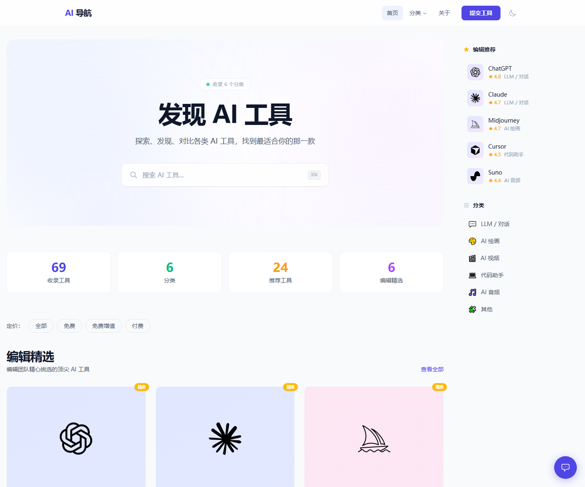
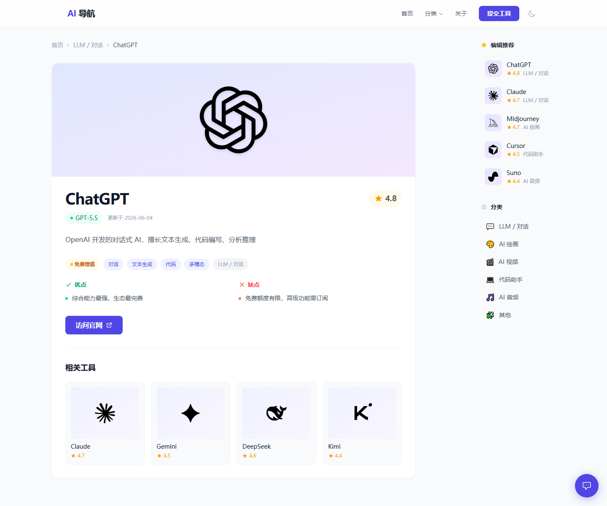
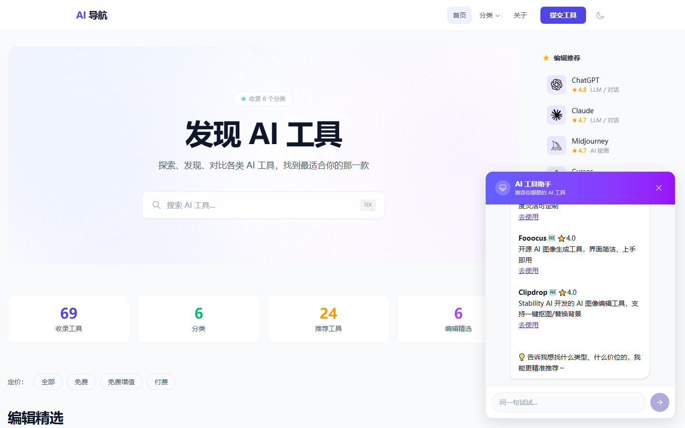
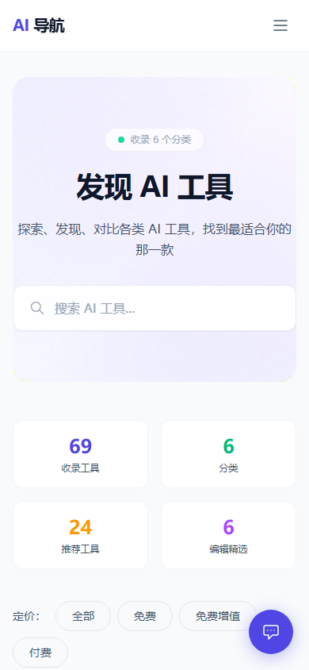

# AI Tool Navigator · AI 工具导航

> 一个帮你在「ChatGPT 之外」发现 AI 工具的导航站。
> 用 Vue 3 + FastAPI + DeepSeek 智能体构建，支持自然语言推荐。

**线上 Demo**：https://backend-six-alpha-77.vercel.app
*（部署在 Vercel 东京区域，国内访问较慢，建议使用代理或耐心等几秒）*

## 截图预览

<table>
<tr>
<td width="50%"></td>
<td width="50%"></td>
</tr>
<tr>
<td></td>
<td></td>
</tr>
</table>

---

## 它解决什么问题

ChatGPT 火了之后，AI 工具呈爆发增长，但用户的痛点反而更尖锐了：

- **不知道有什么工具**：除了 ChatGPT 还能用什么？
- **不知道怎么选**：同样是 AI 绘画，Midjourney / Flux / Stable Diffusion 怎么挑？
- **不知道哪个免费**：付费、免费增值、免费的边界很模糊

本项目把分散的 AI 工具按场景分类整理（69 个工具 / 6 个分类），并提供一个**自然语言智能体**——用户只需要描述需求（"推荐免费的视频生成工具"），AI 就能从数据库中筛选推荐。

---

## 核心特性

| 模块 | 特性 |
|------|------|
| 🏠 首页 | 编辑精选、热门工具、分类入口、统计仪表 |
| 🔍 搜索 | 实时搜索（300ms 防抖）+ 定价/分类筛选 |
| 📂 分类 | 6 大分类（LLM / 绘画 / 视频 / 编程 / 音频 / 其他） |
| 🛠️ 工具详情 | 字段含评分、定价、标签、优缺点、demo 图、相关推荐 |
| 🤖 AI 助手 | 自然语言对话推荐，DeepSeek API 解析意图 + 数据库召回 |
| 📝 提交工具 | 用户可提交新工具，等待编辑审核 |
| 🌓 深色模式 | 自动跟随系统 + 手动切换 |
| 📱 响应式 | 移动端汉堡菜单、断点适配 |

---

## 技术栈 + 几个值得说的设计

**前端**：Vue 3 (Composition API) · Vite · Tailwind CSS v4 · Pinia · Vue Router · Axios

**后端**：FastAPI · SQLAlchemy · SQLite · APScheduler · OpenAI SDK（指向 DeepSeek）

**部署**：Vercel 单项目合并部署（前后端同域），函数区域 hnd1 东京

### 几个非显然的工程决策

**1. AI 助手不让 LLM 写 SQL，让它输出 JSON 参数**
SYSTEM_PROMPT 要求 DeepSeek 严格输出 `{query, category_slug, pricing, max_results}` 结构。后端用这些参数走预定义的搜索逻辑。**可控性 >> 灵活性**——LLM 写 SQL 容易翻车，且面试场景下"安全可控"是加分项。

**2. 自定义内存限流器，不引入 slowapi**
`RateLimiter` 类实现 5 次/分钟、200 次/天的 IP 级限流。代码 30 行，零依赖。同时配 5000 tokens/天的预算上限，防止 DeepSeek API 被刷爆。

**3. 服务端持有 API key，前端无感知**
DeepSeek key 只在后端 `.env` 中，前端永远不直接调用 LLM。哪怕反编译前端代码也拿不到 key。

**4. 动态调度间隔的版本嗅探**
APScheduler 后台任务定时检查工具版本：成功 → 12 小时间隔，失败 → 30 分钟快速重试。能在网络恢复后立刻感知。

**5. 关键词同义词扩展 + 意图分类兜底**
用户说"画画" → 扩展为 ["绘画","图像","图片","AI 绘画","image"]；如果关键词搜索无结果，按"画→ai-image"映射降级到分类搜索。**避免"明明有工具却说没有"的尴尬**。

**6. 前后端合并到 Vercel 单项目**
不是前后端分离两个部署。原因：避免跨域、统一域名、降低运维成本。代价是数据库变只读，但对作品集场景无影响（写入需求极低）。

---

## 架构

```
                    用户浏览器
                        ↓
        ┌───────────────────────────────┐
        │  Vercel (Tokyo hnd1)          │
        │  ┌─────────────────────────┐  │
        │  │  FastAPI 单进程          │  │
        │  │  ├ /api/*  REST 接口    │  │
        │  │  ├ /api/agent/chat      │──┼──→ DeepSeek API
        │  │  ├ /static/*  Logo 图片 │  │
        │  │  └ /  → SPA fallback    │  │
        │  │     ↓                   │  │
        │  │  Vue 3 SPA (Pinia)      │  │
        │  └─────────────────────────┘  │
        │           ↓                   │
        │    SQLite (data.db, 只读)     │
        └───────────────────────────────┘
```

---

## 本地开发

需要 Python 3.12 + Node 22+。

```bash
# 后端
cd backend
pip install -r requirements.txt
echo "DEEPSEEK_API_KEY=your_key" > .env
python -m uvicorn main:app --reload --port 8899

# 前端（新终端）
cd frontend
npm install
npm run dev
# 打开 http://localhost:5173
```

API 文档自动生成：http://localhost:8899/docs

> Windows 注意：8000 端口有 TCP 幽灵条目残留问题，请使用 8899。`--reload` 在 Windows 不可靠，改代码后手动重启。

---

## 已知限制（诚实说）

| 限制 | 原因 | 计划 |
|------|------|------|
| Vercel 数据库只读 | serverless 文件系统限制 | 计划迁移到 PostgreSQL |
| 国内访问慢 | Vercel 在中国无 CDN 节点 | 计划接入 Cloudflare 代理 + 自定义域名 |
| 移动端冷启动可能超时 | Python 函数冷启动 + 网络往返 | 计划接 UptimeRobot keep-warm |
| 用户提交不持久化 | 数据库只读副作用 | 同上，等 PostgreSQL 迁移 |
| 仅 6 分类 69 工具 | MVP 范围聚焦核心功能 | 持续扩充 |

---

## 项目文档

| 文档 | 内容 |
|------|------|
| [PRD](docs/PRD.md) | 产品需求定义 |
| [项目章程](docs/项目章程.md) | 项目范围、成功标准 |
| [API 接口契约](docs/api-contract.md) | 前后端接口定义 |
| [决策日志](docs/decisions.md) | ADR 关键决策记录 |
| [部署文档](docs/deployment.md) | 部署方案 |
| [对接文档（HANDOVER）](HANDOVER.md) | 给新成员的快速接手指南 |
| [复盘报告](docs/复盘报告.md) | 项目复盘 |
| [面试材料清单](docs/面试材料清单.md) | 面试准备 |

---

## 关于作者

这是一个 AI PM 面试作品集项目，目标是完整展示「从需求分析 → 产品设计 → 技术选型 → 全栈开发 → 部署上线 → 复盘优化」的全流程能力。

代码不复杂，但每一个非显然的决策都有原因。欢迎在 [关于页面](https://backend-six-alpha-77.vercel.app/about) 了解更多背景。
